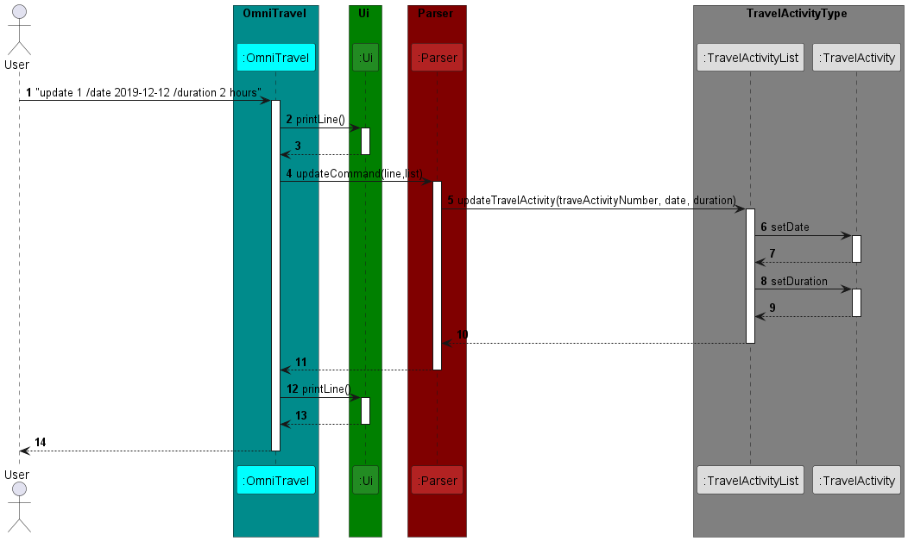
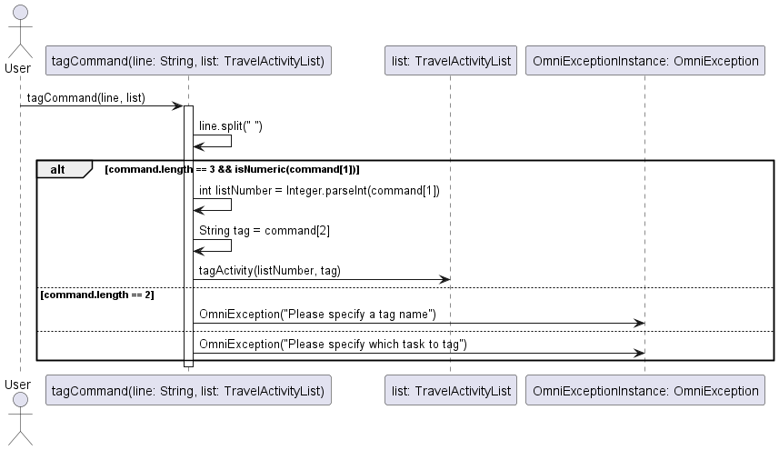

# Developer Guide

## Acknowledgements

{list here sources of all reused/adapted ideas, code, documentation, and third-party libraries -- include links to the original source as well}

## Design & implementation
{Describe the design and implementation of the product. Use UML diagrams and short code snippets where applicable.}

### Save feature

The save feature is facilitated by `FileSave`. It makes calls to the subclasses `Accommodation`, `Food` and `Landmark`
which are subclasses of the `TravelActivity` class to add each activity saved in the text file.

`addTravelActivity` is called everytime there is a valid-stored data in the text file that is read to upload the
activity back into the array list.

The Sequence Diagram below shows how the save file feature is being implemented when the user re-enters the chatbot
after using the bye command.

The above sequence diagram shows how existing save text files will be reloaded back into Omnibots array list to act as
a form of save feature when the user exits the bot. 

#[Proposed] Update feature

Proposed Implementation

The proposed update feature is mainly carried out by `TravelActivityList`. It stores objects with class `TravelActivity`in an array called `travelActivities`
and each `TravelActivity` class object contains a date and duration. The `TravelAcivityList` also contains the following method:
* `TravelActivityList#updateTravelActivity(travelActivityNumber, date, duration)`-- Updates the date and duration of the specified object of `TravelActivity` class type.

Step 1. When the user launches the app for the first time, there will be no objects of type `TravelActivity` in `travelActivities`.
Thus any attempts to call the command `update INDEX`
will result in an output telling the user that no travel activity can be found.

Step 2. After the user has added new travel activities into the `travelActivityList`, the user can execute
`update 1 /date 2020-12-20 /duration 2hours` command to update the date and duration of the first travel activity
in the travel activity list. The `update` command calls the `Parser#updateCommand(line, list)` which then calls the `TravelActivityList#updateTravelActivity(travelActivityNumber, date, duration)`
. 

Step 3. The method will then find the travel activity with the corresponding travel activity number in the `travelActivities` and then set the new date and duration
of that travel activity.

The sequence diagram below shows how an update operation goes through the parser component:

#[Proposed] Total Expense feature

Proposed Implementation

The proposed total expense feature is mainly carried out by `TravelActivityList`. It stores objects with class `TravelActivity`in an array called `travelActivities`
and each `TravelActivity` class object contains an expense associated with it. The `TravelAcivityList` also contains the following method:
* `TravelActivityList#totalExpense()`-- Returns the total expense of all activities in the list.

Step 1. When the user launched the app for the first time, there will be no objects of type `TravelActivity` in `travelActivities`.
Thus any attempts to call the command `total expense`
will result in an output of `0`.

Step 2. After the user has added new travel activities into the `travelActivityList`, the user can execute
`total expense` command to get the total expense for the activities in the list. The `total expense` command calls the  `Parser#totalExpenseCommand(line, list)` which then calls the `TravelActivityList#totalExpense()`

Step 3. The method will loop through each activity in `travelActivities` and add up all the expenses.

### Tag feature

The tag feature is implemented through the tagCommand method, which allows users to add tags to specific travel activities stored in the system.

The sequence diagram depicts the interaction between the user, the tagCommand method, the TravelActivityList instance, and the OmniException instance.

## Product scope
### Target user profile

{Describe the target user profile}

### Value proposition

Tourists may have many plans during their holiday. Omnitravel aims to be a one-stop-shop for all travel plans.
Omnitravels stores the user's travel plans and enable them to quickly retrieve their travel plans using the search 
functions.

## User Stories

| Version | As a ... | I want to ...                                                  | So that I can ...                                                                         |
|---------|----------|----------------------------------------------------------------|-------------------------------------------------------------------------------------------|
| v1.0    | new user | see a list of my travel plans                                  | refer and know what activities I have planned for the day                                 |
| v1.0    | user     | be able to label my destinations                               | identify the type of activity easily                                                      |
| v1.0    | user     | be able to add and remove activities from my planner           | easily make changes to my current activity list                                           | 
| v1.0    | user     | be able to add tags or categories to my activities             | organise them based on my preferences                                                     |
| v1.0    | user     | be able to check and uncheck my travel activities              | easily mark the activities that I have done if I do not follow the sequence of activities |
| v1.0    | user     | have a help option                                             | easily identify all the commands in the chatbot                                           |
| v1.0    | user     | be able to search for an activity already recorded in the list | easily retrieve exisiting plans and not have double inputs                                |
| v2.0    | user     | maintain my expense records                                    | make travel plans according to my budget                                                  |
| v2.0    | user     | be able to see the travel durations                            | plan my activities more efficiently                                                       |
| v2.0    | user     | be able to search for an activity based on its type or tag     | find specific places in my list more efficiently                                          |
| v2.0    | user     | be able to delete a destination from my records                | remove redundant records that I do not need                                               |
| v2.0    | user     | be able to edit and update existing plans                      | efficiently update exisiting plans without having to delete and add plans                 |
| v2.0    | user     | have some form of QOL considerations like warning messages     | know what are the errors that I have made in the inputs                                   |

## Non-Functional Requirements

{Give non-functional requirements}

## Glossary

* *glossary item* - Definition

## Instructions for manual testing

{Give instructions on how to do a manual product testing e.g., how to load sample data to be used for testing}

- To add a general travel activity into the list

Example: `add visit Paris /date 2024-12-12 /duration 2 weeks`

Expected: A new general activity is added

- To add an accommodation activity into the list

Example: `accommodation hotel /date 2024-12-12 /duration one night`

Expected: A new accommodation activity type is added

- To add a food activity into the list

Example: `food prata /date 2024-12-12 /duration 1 hour`

Expected: A new food activity type is added

- To add a landmark activity into the list

Example: `landmark Eiffel Tower /date 2024-12-12 /duration 2 hour`

Expected: A new landmark activity type is added

- To delete an activity from the list

Example: `delete 1`

Expected: The general activity "visit Paris" should be deleted

- To update an existing activity date and duration in the list

Example: `update 1 /date 2024-12-13 /duration two nights`

Expected: The accommodation activity hotel would be on 13th Dec 2024 instead of 12th Dec 2024 and be for two nights instead of one 

- To list out the current activity list

Example: `list`

Expected: The current activity list will be shown by the chatbot

- To find all travel plans with the same keyword

Example: `find rvrc`

Result:
____________________________________________________________
Here are what you are looking for:
1. Accommodation: rvrc :24 Dec 2024 :2 weeks
____________________________________________________________

- To find all travel plans with the same tag

Example: findtag delicacies

Result: 
____________________________________________________________
Here are what you are looking for:
1. Food: Popia :1 Dec 2020 :1hour
2. Food: kfc :12 Dec 2024 :1 hour
____________________________________________________________

- To tag a travel plan

Example: tag 2 activity 1

Result:
____________________________________________________________
I have tagged this task: 
Visit museum (activity 1)
____________________________________________________________

- To untag a travel plan

Example: untag 2

Result:
____________________________________________________________
Tag removed from the task:
Visit museum
____________________________________________________________

- To add an expense to a travel plan

Example: expense 1 $50

Result:
____________________________________________________________
I have added expense for this task:
Visit museum ($50)
____________________________________________________________

- To remove expense from a travel plan

Example: removeexpense 1

Result:
____________________________________________________________
Expense removed from the task:
Visit museum
____________________________________________________________

