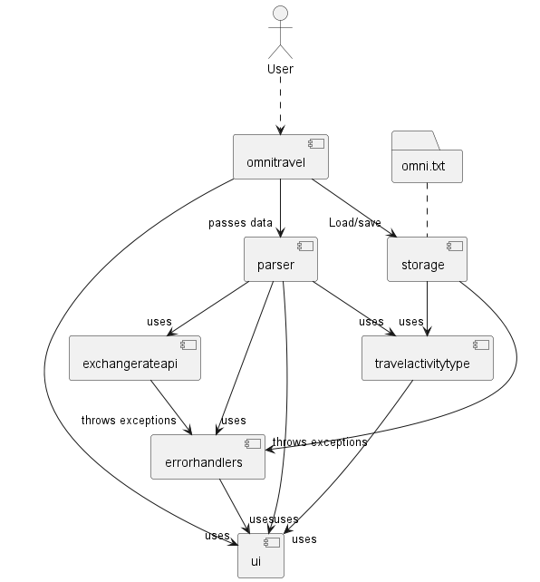
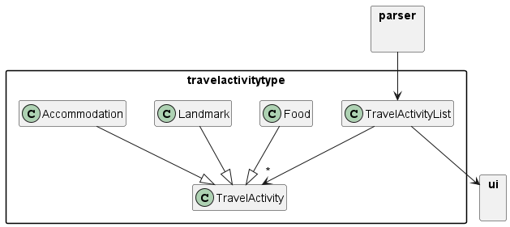
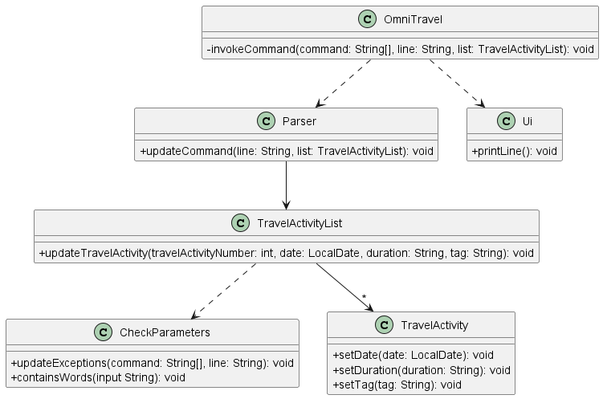
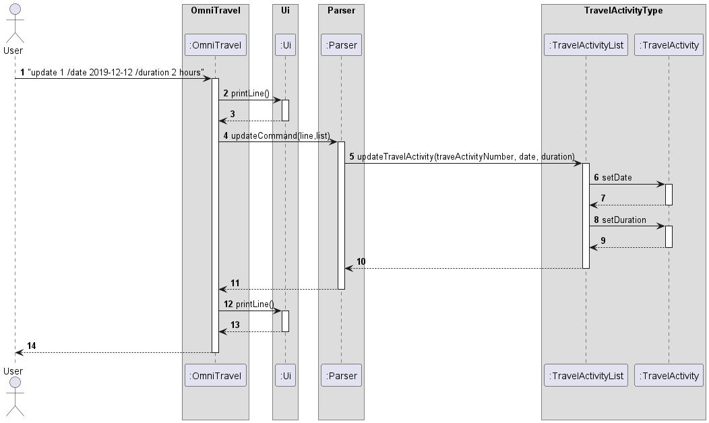
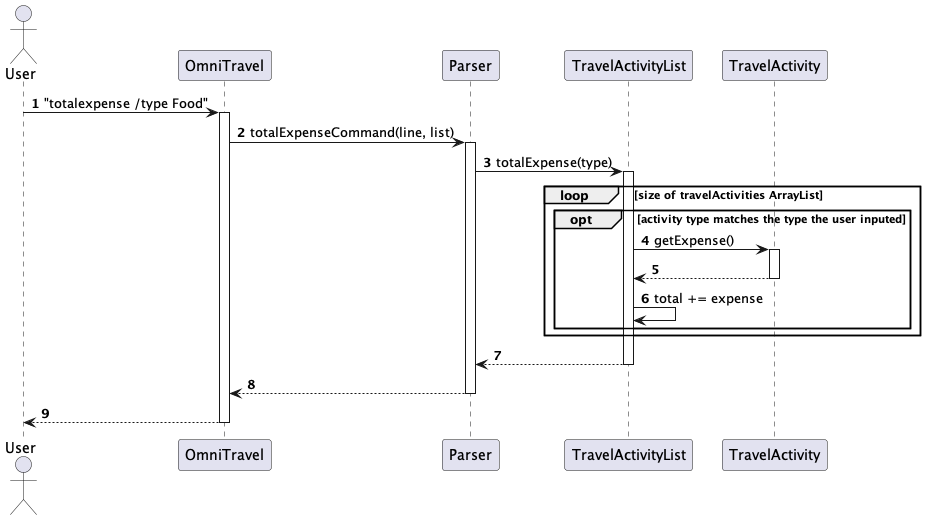

# Developer Guide
* [Acknowledgements](#acknowledgements)
* [Design](#design)
    * [Architecture](#architecture)
    * [Storage component](#storage-component)
    * [Parser component](#parser-component)
    * [TravelActivityTypes component](#travelactivitytypes-component)
    * [Ui component](#ui-component)
    * [Errorhandlers component](#errorhandlers-component)
* [Implementation](#implementation)
    * [Save feature](#save-feature)
    * [Update feature](#update-feature)
    * [Total expense feature](#total-expense-feature)
    * [Tag feature](#tag-feature)
* [Appendix: Requirements](#appendix-requirements)
    * [Product scope](#product-scope)
    * [User stories](#user-stories)
    * [Non-functional requirements](#non-functional-requirements)
    * [Glossary](#glossary)
* [Appendix: Instructions for manual testing](#appendix-instructions-for-manual-testing)
    * [Launch and shutdown](#launch-and-shutdown)
    * [Adding a travel activity](#adding-a-travel-activity)
    * [Deleting a travel activity](#deleting-a-travel-activity)
    * [Updating a travel activity](#updating-a-travel-activity)
    * [List travel activities](#list-travel-activities)
    * [Finding a travel activity](#finding-a-travel-activity)
    * [Finding a travel activity with a tag](#finding-a-travel-activity-with-a-tag)
    * [Finding a type of travel activity](#finding-a-type-of-travel-activity)
    * [Adding an expense](#adding-an-expense)
    * [Deleting an expense](#deleting-an-expense)
    * [Converting currency](#converting-currency)
    * [Add tag](#add-tag)
    * [Remove tag](#remove-tag)
    * [List tags](#list-tags)
    * [Checking a travel activtiy](#checking-a-travel-activity)
    * [Unchecking a travel activity](#unchecking-a-travel-activity)
    * [Show help](#show-help)

## Acknowledgements

Source for currency exchange API: [link](https://github.com/fawazahmed0/exchange-api/blob/main/LICENSE)

## Design

### Architecture

The architecture diagram above describes the high level design of the OmniTravel app.

**Main components of the architecture**

`omnitravel` which consists of the class `OmniTravel` has the responsibility of launching the app and shutting down.
* When the app launches, it initializes the other components in the app.
* When it shuts down, it will also shut down the other components.

The main components of the system are as follows:
* `storage`: It reads data from the folder omni.txt and writes data to it.
* `parser`: It filters the commands and executes them.
* `travelactivitytypes`: It holds the data of the app in memory.
* `ui`: The UI of the app.
* `errorhandlers`: It handles all the exceptions and checks for any errors in the app.

### Storage component
The Storage component only consists of one class `FileSave`. 

The storage component,
* saves the data of the different travel activity types, including their tags, expenses, type and
description.
* it listens to the `omnitravel` component to know when to save and load the file from omni.txt into the app.
* it retrieves travel activity objects from the `travelactivitytype` component to save.

### Parser component
The parser component only consists of one class `Parser`. 

The parser component,
* handles all the command inputs by the user
  and carries out the appropriate actions depending on the command given.
* uses the `ui` component to print responses to the user
* sends commands to the `exchangerateapi` and `travelactivitytype` components to execute.
* receives data from the `omnitravel` component.

### TravelActivityTypes component

The TravelActivityTypes component consists of a few different classes:
* `Accommodation`: A subclass of travel activity related to accommodation
* `Food`: A subclass of travel activity related to food
* `Landmark`: A subclass of travel activity related to landmark
* `TravelActivtiy`: The parent class of `Accommodation`, `Food` and `Landmark`
* `TravelActivityList`: An array consisting of travel activity type objects

The `TravelActivityTypes` component,
* stores all the travel activity type objects in an array.
* listens to the `parser` component for any commands to execute.

### Ui component
The Ui component only consists of one class `Ui`.

The Ui component, 
* listens to the `omnitravel`, `parser` and `travelactivitytypes` component to print out
the responses to the user.
* contains all the responses to each of the user's input command
* takes in exceptions as parameters and prints out the error message.

### Errorhandlers component

The Errorhandler component consists of two classes `CheckParameters` and `OmniException`.
`OmniException` is a subclass of the parent class `Exception`.

The Errorhandler component,
* checks the parameters of the commands given by the user.
* handles all the exceptions and errors in the app.
* keeps a reference to `ui` component to print error messages.

## Implementation

### Save feature

The save feature is facilitated by `FileSave`. It makes calls to the subclasses `Accommodation`, `Food` and `Landmark`
which are subclasses of the `TravelActivity` class to add each activity saved in the text file.

`addTravelActivity` is called everytime there is a valid-stored data in the text file that is read to upload the
activity back into the array list.

Step 1. When the user launches the app for the first time, it will check if the text file `omni.txt` exist.

Step 2. Once it is found that the text file exists, the `readFile()` method will call `loadFileContents(list)`.

Step 3. In the `loadFileContents(list)`, `Scanner(f)` would read the text file line by line and insert each line into
the respective activity types and its contents with `/` as the delimiter.

The Sequence Diagram below shows how the save file feature is being implemented when the user re-enters the chatbot
after using the bye command.

The above sequence diagram shows how existing save text files will be reloaded back into Omnibots array list to act as
a form of save feature when the user exits the bot. 

The above class diagram shows the methods and the respective input and return types that the FileSave class contains. It
also shows the classes called during the file load sequence.

### Update feature

The update feature is mainly carried out by `TravelActivityList`. It stores objects with class `TravelActivity`in an array called `travelActivities`
and each `TravelActivity` class object contains a date and duration. The `TravelAcivityList` also contains the following method:
* `TravelActivityList#updateTravelActivity(travelActivityNumber, date, duration)`-- Updates the date and duration of the specified object of `TravelActivity` class type.

Step 1. When the user launches the app for the first time, there will be no objects of type `TravelActivity` in `travelActivities`.
Thus, any attempts to call the command `update INDEX`
will result in an output telling the user that no travel activity can be found.

Step 2. After the user has added new travel activities into the `travelActivityList`, the user can execute
`update 1 /date 2020-12-20 /duration 2hours` command to update the date and duration of the first travel activity
in the travel activity list. The `update` command calls the `Parser#updateCommand(line, list)` which then calls the `TravelActivityList#updateTravelActivity(travelActivityNumber, date, duration)`
. 

Step 3. The method will then find the travel activity with the corresponding travel activity number in the `travelActivities` and then set the new date and duration
of that travel activity.

The class diagram below shows the main relationship between the classes in the update feature:

The sequence diagram below shows how an update operation goes through the parser component:

### Total Expense feature

The total expense feature is mainly carried out by `TravelActivityList`. It stores objects with class `TravelActivity`in an array called `travelActivities`
and each `TravelActivity` class object contains an expense associated with it. The `TravelAcivityList` also contains the following method:
* `TravelActivityList#totalExpense(type)`-- Returns the total expense of activities in the list with given type.

Step 1. When the user launched the app for the first time, there will be no objects of type `TravelActivity` in `travelActivities`.
Thus any attempts to call the command `total expense`
will result in an output of `0`.

Step 2. After the user has added new travel activities into the `travelActivityList`, the user can execute
`totalexpense [/type TYPE]` command to get the total expense for the activities in the list. The `total expense` command calls the  `Parser#totalExpenseCommand(line, list)` which then calls the `TravelActivityList#totalExpense(type)`.

Step 3. The method will loop through each activity in `travelActivities` and add up all the expenses for the given type. If no type is provided, it will default to TravelActivity type.

### Tag feature

The tag feature is implemented through the tagCommand method, which allows users to add tags to specific travel activities stored in the system.

The sequence diagram depicts the interaction between the user, the tagCommand method, the TravelActivityList instance, and the OmniException instance.

## Appendix: Requirements
## Product scope
### Target user profile
* Needs to manage multiple travel plans
* Prefers typing to clicking with mouse

### Value proposition
Tourists may have many plans during their holiday. Omnitravel aims to be a one-stop-shop for all travel plans.
Omnitravels stores the user's travel plans and enable them to quickly retrieve their travel plans using the search 
functions.

## User Stories

| Version | As a ... | I want to ...                                                  | So that I can ...                                                                         |
|---------|----------|----------------------------------------------------------------|-------------------------------------------------------------------------------------------|
| v1.0    | new user | see a list of my travel plans                                  | refer and know what activities I have planned for the day                                 |
| v1.0    | user     | be able to label my destinations                               | identify the type of activity easily                                                      |
| v1.0    | user     | be able to add and remove activities from my planner           | easily make changes to my current activity list                                           | 
| v1.0    | user     | be able to add tags or categories to my activities             | organise them based on my preferences                                                     |
| v1.0    | user     | be able to check and uncheck my travel activities              | easily mark the activities that I have done if I do not follow the sequence of activities |
| v1.0    | user     | have a help option                                             | easily identify all the commands in the chatbot                                           |
| v1.0    | user     | be able to search for an activity already recorded in the list | easily retrieve exisiting plans and not have double inputs                                |
| v2.0    | user     | maintain my expense records                                    | make travel plans according to my budget                                                  |
| v2.0    | user     | be able to see the travel durations                            | plan my activities more efficiently                                                       |
| v2.0    | user     | be able to search for an activity based on its type or tag     | find specific places in my list more efficiently                                          |
| v2.0    | user     | be able to delete a destination from my records                | remove redundant records that I do not need                                               |
| v2.0    | user     | be able to edit and update existing plans                      | efficiently update exisiting plans without having to delete and add plans                 |
| v2.0    | user     | have some form of QOL considerations like warning messages     | know what are the errors that I have made in the inputs                                   |
| v2.1    | user     | be able to convert from one currency to another                | know how much of a currency I need to convert for usage                                   |
| v2.1    | user     | be able to list all the tags I have given to the activities    | easily see what are the tags I currently have in the list                                 |
| v2.1    | user     | be able to sort out the list of activities based on dates      | easily view the entire flow of my travel plan                                             |
| v2.1    | user     | be able to group and delete similar activities                 | easily manage and delete similar plans in one go                                          |

## Non-Functional Requirements

1. The program should be able to run on any mainstream OS with java 11 installed
2. Users should be able to hold all travel plans in a typical travel period.
3. A user with above average typing speed for regular English text should be able to accomplish most of the tasks faster
using commands than using the mouse.

## Glossary

* Mainstream OS: Windows, Linux, MacOS

## Appendix: Instructions for manual testing

The instructions given below are used for testing the app manually.

### Launch and shutdown
1. Initial launch
    1. Download the jar file and put it into an empty folder.
    2. Open a terminal in that empty folder and type java-jar Omnitravel.jar into the terminal.
2. Shutdown
    1. When the app is running, type `bye` into the terminal to close the app.

More info can be found in the user guide [here](https://ay2324s2-cs2113-t12-4.github.io/tp/UserGuide.html).

### Adding a travel activity
1. Adding a general travel activity
    1. Test case: `add visit Paris /date 2024-12-12 /duration 2 weeks`

       Expected: A new general activity is added and the details of the activity is shown

    2. Test case: `add visit Japan /date 2024-08-12 /duration 2 weeks /tag friday`

       Expected: A new general activity is added with a tag and the details of the activity is shown

2. Adding an accommodation activity into the list
    1. Test case: `accommodation hotel /date 2024-12-12 /duration one month`

       Expected: A new accommodation activity type is added and the details of the activity is shown

    2. Test case: `accommodation motel /date 2024-10-12 /duration one month /tag Monday`

       Expected: A new accommodation activity type is added with a tag and the details of the activity is shown

3. Adding a food activity into the list
    1. Test case: `food prata /date 2024-12-12 /duration 1 hour`

       Expected: A new food activity type is added and the details of the activity is shown

    2. Test case: `food takoyaki /date 2024-10-12 /duration 1 hour /tag Japanese food`

       Expected: A new food activity type is added with a tag and the details of the activity is shown

4. Adding a landmark activity into the list
    1. Test case: `landmark Eiffel Tower /date 2024-12-12 /duration 2 hour`
       
       Expected: A new landmark activity type is added and the details of the activity is shown

    2. Test case: `landmark Pyramid /date 2025-12-12 /duration 3 hours /tag Tuesday`

       Expected: A new landmark activity type is added with a tag and the details of the activity is shown

### Deleting a travel activity
1. Deleting a travel activity that is present in the list
    1. Prerequisites: Add 2 new activities with description "Go to Paris" and another with
       description "Go home". List all the travel activities using the `list` command.

    2. Test case: `delete 1`
   
       Expected: Deletes the first activity in the list and details of the deleted activity is shown in the terminal

    3. Test case: `delete home`

       Expected: Deletes the activities with the description containing the keyword "home" and the
       activities deleted will be shown in a list 

    4. Test case: `delete -1` 

       Expected: An error message will be shown in the terminal and no activity is deleted.

### Updating a travel activity
1. Updating a travel activity that is present in the list
    1. Prerequisites: List all the travel activities using the `list` command.
    
    2. Test case: `update 1 /date 2024-12-13 /duration two days`
    
       Expected: The first activity in the list will be updated with a new date and duration. The details of the activity
        will be shown.

    3. Test case: `update 2 /date 2024-12-13 /duration two days /tag Friday`

       Expected: The second activity in the list will be updated with a new date, duration and tag. The details of the activity
       will be shown.

    4. Test case: `update -1 /date 2025-12-12 /duration five days /tag Monday`

       Expected: No activity will be updated and an error message will be shown

### List travel activities
1. To list out the current activity list
    1. Test case: `list`
    
       Expected: The current activity list will be shown without any sorting order
   
    2. Test case: `list /date 2024-12-12`
   
       Expected: All the activities with the date 2024-12-12 will be shown
   
    3. Test case: `list /sort`
   
       Expected: All the activities will be shown in a list by ascending dates 

### Finding a travel activity
1. To find all travel activities with the same keyword
    1. Prerequisite: Add 2 new travel activities, one with the description "go to paris"
        and the other with the description "fly to paris".
   
    2. Test case: `find paris`
       
       Expected: The activities with "paris" in the description will be shown in a list.

2. To find all travel activities with the same keyword and with exclusion
    1. Test case: `find paris /exclude fly`
    
       Expected: The activities with the keyword "paris" and excluding "fly" in the description will
       be shown in a list 

### Finding a travel activity with a tag
1. To find all the travel activities with the same tag
    1. Prerequisites: Add 2 new travel activities with the same tag "Friday" and with descriptions
        "Paris" and "Hong Kong".

    2. Test case: `findtag Friday`

       Expected: The activities with the tag "Friday" will be shown in a list

2. To find all the travel activities with the same tag with exclusions
    1. Test case: `findtag Friday /exclude Paris`
        
       Expected: The activities with the tag "Friday" and without the keyword "Paris" in the
        description will be shown in a list.

### Finding a type of travel activity
1. To find all travel activities of a certain type
    1. Prerequisites: Create one Food type and one Food type travel activity with the
        description "Takoyaki" and "Chicken rice".

    2. Test case: `findtype Food`
   
       Expected: The activities of food type will be shown in the list

2. To find all the travel activities of a certain type with exclusions
    1. Test case: `findtype Food /exclude Takoyaki`

       Expected: The activities of food type without the keyword "Takoyaki" in their description
       will be shown in a list. 

### Adding an expense
1. Adding expense to an activity currently in the list
    1. Prerequisites: List all the travel activities using the `list` command.

    2. Test case: `expense 1 $40`

       Expected: An expense of $40 will be added to the first activity in the list and the details
        of the activity will be shown

2. Adding expense to an activity not in the list
    1. Test case: `expense 1 $-1`

       Expected: No expense will be added and an error message will be shown.

### Deleting an expense
1. Deleting an expense from an activity currently in the list
    1. Prerequisites: List all the travel activities using the `list` command.

    2. Test case: `removeexpense 1`
    
       Expected: The expense of the first activity in the list will be removed. The details of the activity will
       be shown

2. Deleting an expense from an activity not in the list
    1. Test case: `removeexpense 0`

       Expected: No expense is removed and an error message will be shown. 
        
### Converting currency
1. Converting a local currency to a foreign currency
    1. Test case: `change 100 /from sgd /to jyp`
   
       Expected: The conversion of 100 singapore dollars to japanese yen will be shown

### Add tag
1. Adding a tag to a travel activity currently in the list
    1. Prerequisites: List all the travel activities using the `list` command.
    
    2. Test case: `tag 1 Friday`

       Expected: A tag will be added to the first activity in the list and the details
       of the activity will be shown

2. Adding a tag to a travel activity not in the list   
    1. Test case: `tag 0 Friday`

       Expected: No tag will be added and a error message will be shown 

### Remove tag
1. Removing a tag from a travel activity currently in the list
    1. Prerequisites: List all the travel activities using the `list` command.
   
    2. Test case: `untag 1`

       Expected: The tag will be removed from the first activity and the details of the activity will be shown
   
2. Removing a tag from a travel activity not in the list
    1. Test case: `untag 0`
   
       Expected: No tag will be removed and an error message will be shown 

### List tags
1. Listing out all the tags in the current list
    1. Prerequisites: There must be tags in the current list
   
    2. Test case: `listtags`

       Expected: All the tags currently in the list will be shown in a list in alphabetical order

### Checking a travel activity
1. Checking a travel activity currently in the list
    1. Prerequisites: List all the travel activities using the `list` command.
   
    2. Test case: `check 1`

       Expected: The first activity will be marked with an "X" and the details of the activity will be shown
   
2. Checking a travel activity not in the list
    1. Test case: `check 0`

        Expected: No activity will be marked and an error will be shown

### Unchecking a travel activity
1. Unchecking a checked travel activity in the list
    1. Prerequisites: List all the travel activities using the `list` command.

    2. Test case: `uncheck 1`

       Expected: The first activity will be unmarked and the details of the activity will be shown

2. Unchecking a travel activity not in the list
    1. Test case: `uncheck 0`
   
       Expected: No activity will be unmarked and an error message will be shown

### Show help
1. Shows all the commands the user can input
    1. Test case: `help`

       Expected: All the commands will be shown 

